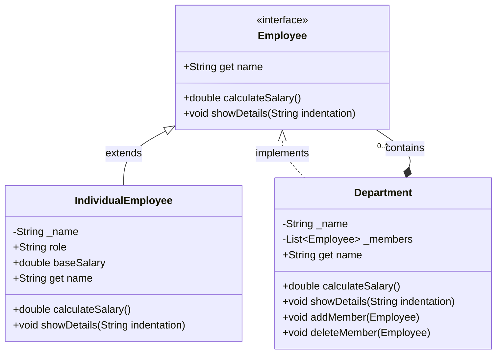
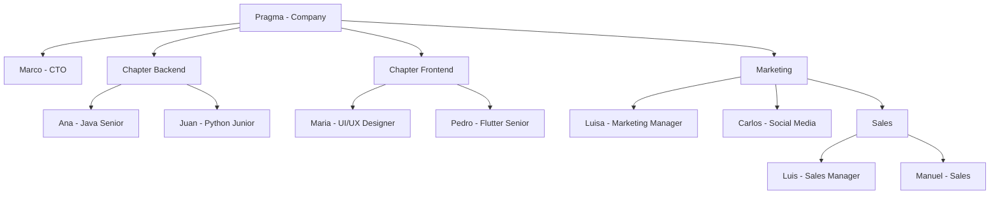

<h1 align="center">
<br>
<a href="http://www.amitmerchant.com/electron-markdownify"></a>
<br>
Patrón Composite
<br>
</h1>

<h4 align="center">Implementación del patrón Composite en un sistema organizacional
con <a href="https://dart.dev" target="_blank">Dart</a>.</h4>

<p align="center">
  <a href="https://dart.dev">
    
  </a>
  <a href="https://flutter.dev">
    
  </a>
  <a href="https://en.wikipedia.org/wiki/SOLID">
    
  </a>
  <a href="https://refactoring.guru/design-patterns/composite">
    
  </a>
  <a href="https://github.com/somospragma">
    
  </a>
</p>

Este proyecto implementa el patrón de diseño Composite para representar una estructura
organizacional jerárquica en Dart. El sistema permite gestionar empleados individuales y
departamentos de manera uniforme, facilitando operaciones como el cálculo de salarios y la
visualización de la estructura organizacional.

<p align="center">
  <a href="#¿qué-es-el-patrón-composite?">¿Qué es el Patrón Composite?</a> •
  <a href="#implementación">Implementación</a> •
  <a href="#estructura-organizacional-de-ejemplo">Estructura</a> •
  <a href="#beneficios-de-esta-implementación">Beneficios</a> •
  <a href="#uso-del-patrón">Uso</a> •
  <a href="#clonar">Clonar</a> •
  <a href="#autor">Autor</a>
</p>

## ¿Qué es el Patrón Composite?

El patrón Composite organiza objetos en estructuras de árbol para representar jerarquías.
Permite que los clientes traten objetos individuales y composiciones de objetos de la misma manera.



## Implementación

### 1. Interfaz Común (Employee)

Definimos la interfaz que comparten todos los componentes:

```dart
abstract interface class Employee {
  String get name;

  double calculateSalary();

  void showDetails(String indentation);
}
```

### 2. Componente Hoja (IndividualEmployee)

Representa a un empleado individual que no puede contener otros componentes:

```dart
class IndividualEmployee extends Employee {
  final String _name;
  final String role;
  final double baseSalary;

  IndividualEmployee(this._name, this.role, this.baseSalary);

  @override
  String get name => _name;

  @override
  double calculateSalary() {
    return baseSalary;
  }

  @override
  void showDetails(String indentation) {
    print('$indentation- $name ($role): \$${baseSalary.toStringAsFixed(2)}');
  }
}
```

### 3. Componente Compuesto (Department)

Representa un departamento que puede contener empleados y otros departamentos:

```dart
class Department implements Employee {
  final String _name;
  final List<Employee> _members = [];

  Department(this._name);

  @override
  String get name => _name;

  @override
  double calculateSalary() {
    return _members.fold(0.0, (sum, member) => sum + member.calculateSalary());
  }

  @override
  void showDetails(String indentation) {
    print('$indentation+ department: $_name');
    for (var member in _members) {
      member.showDetails('$indentation  ');
    }
    print(
      '$indentation Total salaries: \$${calculateSalary().toStringAsFixed(2)}',
    );
  }

  void addMember(Employee member) {
    _members.add(member);
  }

  void deleteMember(Employee member) {
    _members.remove(member);
  }
}
```

## Estructura Organizacional de Ejemplo



## Beneficios de esta Implementación

1. **Transparencia**: Podemos tratar empleados y departamentos con la misma interfaz
2. **Cálculo Automático**: El salario total se calcula recursivamente en toda la jerarquía
3. **Visualización Clara**: La estructura se muestra con indentación apropiada

```text
+ department: Pragma
  - Marco (CTO): $20000.00
  + department: Chapter Backend
    - Ana (Java Senior): $5000.00
    - Juan (Python Junior): $3000.00
   Total salaries: $8000.00
  + department: Chapter Frontend
    - María (UI/UX Designer): $4000.00
    - Pedro (Flutter Senior): $3500.00
   Total salaries: $7500.00
  + department: Marketing
    - Luisa (Marketing Manager): $4500.00
    - Carlos (Social Media): $2800.00
    + department: Sales
      - Luis (Sales Manager): $1.00
      - Manuel (Sales): $2.00
     Total salaries: $3.00
   Total salaries: $7303.00
 Total salaries: $42803.00
```

## Uso del Patrón

```dart
void main() {
  // Crear la estructura organizacional
  final company = Department('Pragma');
  company.addMember(IndividualEmployee('Marco', 'CTO', 20000));

  // Crear departamentos
  final development = Department('Chapter Backend');
  development.addMember(IndividualEmployee('Ana', 'Java Senior', 5000));
  development.addMember(IndividualEmployee('Juan', 'Python Junior', 3000));
  company.addMember(development);

  // Anidar departamentos (Sales dentro de Marketing)
  final marketing = Department('Marketing');
  final sales = Department('Sales');
  sales.addMember(IndividualEmployee('Luis', 'Sales Manager', 1));
  marketing.addMember(sales);

  // Mostrar toda la estructura
  company.showDetails('');
}
```

## Clonar

Para clonar este proyecto:

```bash
git clone https://github.com/privjaac/composite-pattern-dart
cd composite-pattern-dart
```

## Autor


| [<br><sub>Alex Alvarez Casas</sub>](https://github.com/privjaac) | 
|--------------------------------------------------------------------------------------------------------------------------------------------------------------|